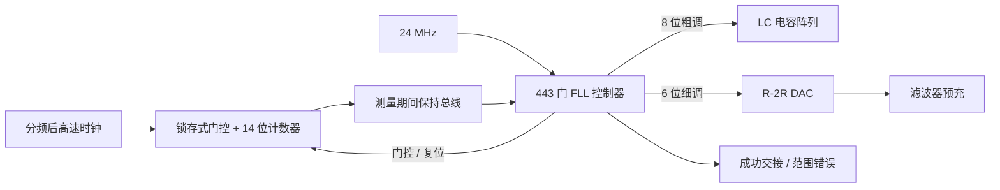
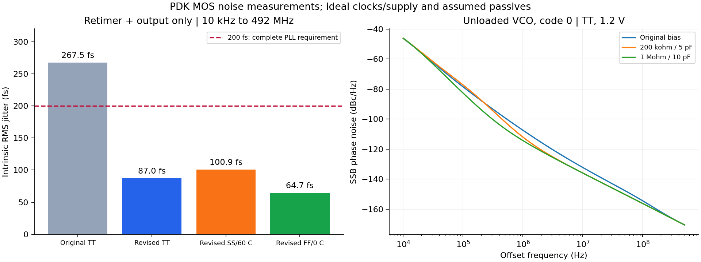
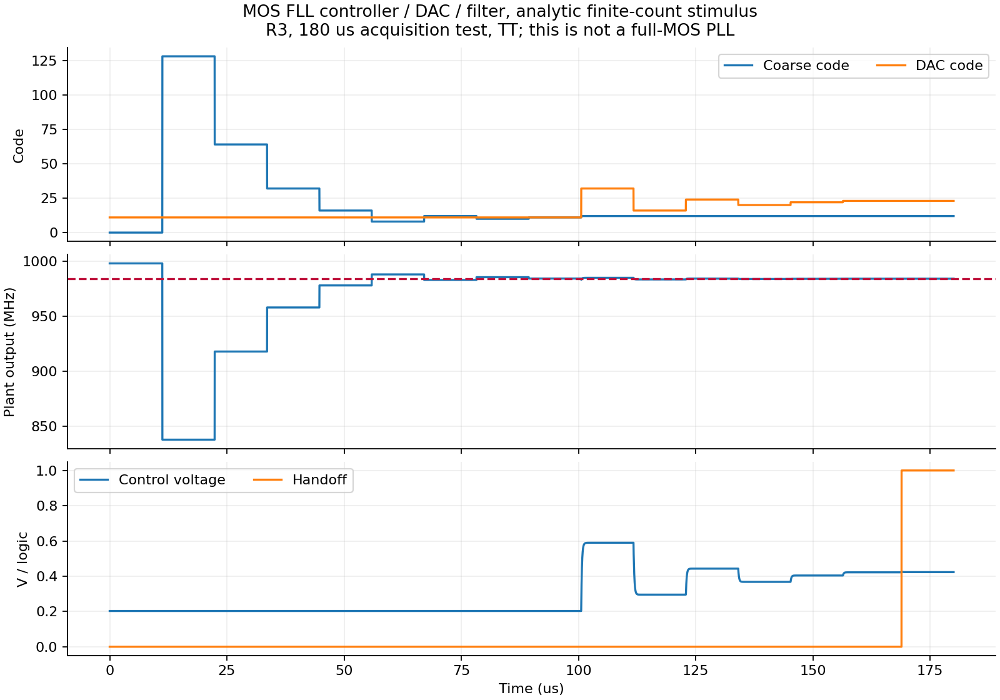
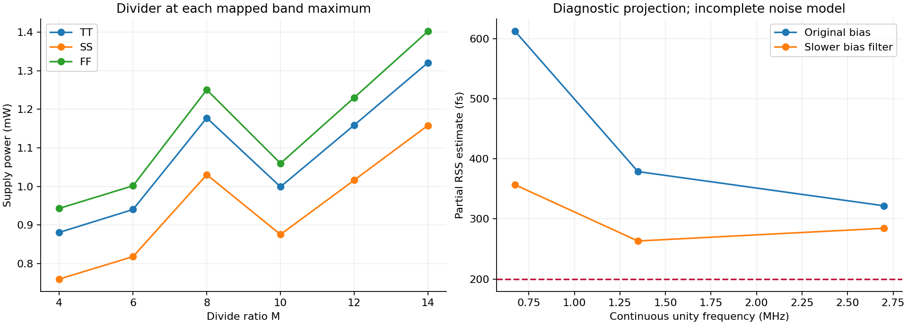

# 分频 / FLL 电路与实际器件噪声

本轮完成六档分频电路、FLL 的 MOS 控制器/计数器/锁存器/DAC，并开展真实 PDK MOS 的 PSS/Pnoise。**尚未完成全晶体管 PLL 或 <200 fs 签核。** 器件噪声已推翻旧假设预算可以直接达标的判断。

随机抖动验收按 [DEC-0004](../../../reports/decisions/DEC-0004.md)：10 kHz 至对应输出频率的一半，排除离散杂散。984 MHz 的上限为 492 MHz；10 kHz–10 MHz 只保留作诊断。功耗继续按 DEC-0001，最终须计入锁定后的全部 PLL，启动峰值另列。

## 分频与实际负载

R3 采用六个可独立关闭的固定 CML Johnson 环，不再在 GHz 反馈路径串接多路选择器；交流偏置限幅器恢复 CMOS 摆幅。÷4/6/8/10/12/14 在各自最高映射 VCO 频率 3.936/3.888/3.456/3.120/3.168/3.024 GHz，TT/27 °C、SS/60 °C、FF/0 °C 共 18 点通过边沿数、周期和逻辑摆幅检查。输入为每侧 0.2 V 峰值正弦，1.2 V 供电，输出 10 fF。

检查窗口为 60–120 ns，允许边界少一个/多一个边沿，逐周期误差限为 2%，检查期间没有漏计/多计的周期。交流偏置仍有缓慢建立，短窗口平均频率的约百 ppm 偏差不是精密频率或随机抖动指标。R3 稳态支路功耗为约 0.77–1.41 mW；未将复位期间电流混入锁定功耗。

接真实 LC、采样器和 CP 后，R3 的时钟输入寄生使 40 fF 固定电容候选最高频率只到约 3.874 GHz，虽然正确分频，**该候选不满足高端覆盖**。保留 R3、把固定电容降至 5 fF 的另一次试验可达约 3.963 GHz。R4 将输入 TG 的 PMOS 从 16 µm 减到 8 µm，保持输入共模 1.0 V，也完成 18/18 角点检查；40 fF 联合负载的高端恢复到约 4.062 GHz。最终 60 fF 电容版本在码 0 的控制 0.2/1.0 V 为 3.983466/4.006439 GHz，码 255 为 2.609135/2.614902 GHz；四点均正确分频，整条测试支路约 2.52–2.75 mW。详见 [validation.json](results/validation.json)。端点抽查不能证明全部 256 个粗调码连续覆盖。

`loop_s8_divider.scs` 在已有 S7 混合 PLL 中替换实际分频器，`loop_s9_noise_output.scs` 再替换低噪声重定时/输出链。两者仍使用行为 VCO、固定粗调码和理想全摆幅重定时时钟，不验证冷启动或完整器件相噪。最终测量见同一验证 JSON。

两次 6 µs 混合闭环均通过当前检查：S8/S9 输出分别为 984.000304/984.000320 MHz，最后 0.5 µs 的同参考相位控制电压峰峰变化为 8.56/4.58 µV；4–6 µs 的已实现部分供电功耗为 1.1991/1.8786 mW。原始周期控制纹波仍约 2.10 mV，不能把它与同相位漂移或随机噪声混淆。功耗不包含 VA VCO、理想输入源提供的 GHz 驱动功率及缺失的实际偏置/控制电路。

混合闭环的检查范围是平均输出频率、累计边沿、占空比和同参考相位的控制电压收敛；保存的是低速监测量，尚未逐周期证明全部建立/保持裕量或提取顶层随机抖动。

## FLL 实现及验证边界

- 最终 R3 的 443 个通用逻辑单元映射到自有 MOS 电路；另有 14 位计数器、14 位保持总线和实际 R-2R DAC。33 个名义频道在映射门图上完成 15 个、每个 256 参考周期的测量；码 0 可直接捕获时为 7 个窗口。另测上下越界错误；这是数字功能验证。
- R2 的 404 门版本在边界复核中发现最小返回码为 1，而且 `range_error=1` 后仍交接。R3 增加首次码 0 测量，并让范围错误保持 `enable=0`。[边界回归](results/fll_boundary_regression.json) 保留旧版实际门图失败和修正版结果。
- R2 晶体管控制器、保持总线、DAC、滤波器使用有限计数宏模型驱动，完整运行 170 µs。`reltol=1e-2` 和 `1e-3` 两次都在约 157.74 µs 交接，最终粗调码 12、DAC 码 23。末端控制电压相差约 17.2 µV；这是 R2 的数值交叉检查，不把它冒充 R3 边界修正后的完整复测。
- R3 的长仿真分别覆盖名义捕获、只能使用码 0 的捕获、不可达高频禁止交接，结果位于 `validation.json` 的 `fll_controller_r3`。测试 VCO 为线性模型、计数为有限窗口宏模型，不能称为 PLL 相位锁定。控制器/DAC 支路的功耗不包含实际计数器持续输入时钟和完整偏置开销。
- 独立 MOS 计数器在 TT/SS/FF、1 GHz 的 256 ns 窗口完成 256 计数。最终版本增加低电平锁存式门控，避免直接与门截断高速时钟。码 0 启动可能超出目标输出频率，另补三角 1.2 GHz 速度余量检查，在指定 256 ns 门控相位下均正确计数 307。完整 256 参考周期窗口、保持总线及全 MOS 首次测量接口的结果分别列在 `fll_window` 和 `fll_coupled_prefix`。
- 长控制器试验仍使用计数宏模型；全 MOS FLL 只按实际完成的耦合窗口报告。**没有将分块验证拼称为完整全器件捕获。** `tb_fll_acquire_r3_full.scs` 已提供 180 µs 的完整器件 FLL TB，但目前仅对应首窗 TB 的实际完成部分有验证证据。后台失锁检测、自动重捕获及真实 LC 调谐表匹配尚未完成。

R3 的三个晶体管控制器测试均已通过（TT/27 °C、1.2 V、理想计数宏模型）：

| 场景 | 测试线性 VCO 参数 | 完成 / 交接时刻 | 最终状态 |
|---|---|---|---|
| 名义捕获 | 4.000 GHz 基频、5 MHz/码、20 MHz/V、M=4 | 约 168.90 µs | 粗调 12、DAC 23，输出约 984.116448 MHz，交接有效 |
| 只能用码 0 捕获 | 3.932 GHz 基频、20 MHz/码、其余相同 | 约 79.58 µs | 粗调 0、DAC 45，输出约 984.116016 MHz，交接有效 |
| 目标高于可达范围 | 3.800 GHz 基频、5.4 MHz/码、其余相同 | 约 79.58 µs 完成判断 | `range_error=1`、`enable=0`，禁止交接 |

成功后的控制器/DAC 支路约 18.25 µW；失败时 DAC 仍保持供电等待外部复位，该支路约 0.213 mW，不把它当作锁定功耗。时间读数受 20 ns 保存间隔限制。当前没有全器件 FLL 已完成全部窗口的结论。

R3 的实际 MOS 计数器、保持总线、控制器、DAC 和滤波器连接后，12 µs 首窗试验得到 10645 个计数，与约 998.014 MHz 的测试激励相符；控制器随后从粗调码 0 更新到 128，保持 `enable=0` 继续搜索。R2 对应首窗的 8939 个计数及 128→64 更新也保留。这验证了真实计数反馈接口，未把只完成一个窗口算作全流程捕获。



## 器件噪声与改进

全部噪声数字均为理想供电、理想输入源下的模块附加噪声，使用实际 PDK MOS。被动元件和参考电流源的实现边界见 [电路说明](../../blocks/transistor_v2/README.md)。

数字缓冲/重定时测量使用 0.6 V 门限的上升沿 `Jee`；它不是周期差分抖动或所有边沿的统计结果。参考慢边沿 TB 的上升/下降时间均为 1 ns、源高平台约 20.823 ns，占空比约 52.4%，原版与改进版采用相同激励；没有假定实际参考源已满足这些条件。

| 测量 | 条件 | 结果与含义 |
|---|---|---|
| 原重定时器 + 输出缓冲 | 984 MHz，TT，10 fF；10 kHz–492 MHz | 267.49 fs，仅该支路就超过整机 200 fs 要求；窄带 61.52 fs 不能用于验收 |
| 改进 C²MOS + 输出 | `scale=4 oscale=4 sp=2.5u`，同频带，TT/SS/FF | 87.01 / 100.89 / 64.74 fs；约 0.879 / 0.880 / 0.873 mW。尚未包含真实 VCO 时钟接收/驱动器 |
| 改进链的最低频道 | 216 MHz，3.024 GHz 理想时钟，10 fF；10 kHz–108 MHz，TT/SS | 86.47 / 120.99 fs；约 0.514 / 0.520 mW。带宽变窄不能直接按平方根比例缩放结果；尚非全 33 点噪声覆盖 |
| 参考缓冲 | 24 MHz，60 fF，TT；10 kHz–12 MHz；理想源 1 ns 边沿 | 原版 348.82 fs；加大前两级后 135.88 fs。它们是参考缓冲输出端噪声，须经 PLL 传递函数才能换算贡献 |
| 采样器 + 跨导级 | 3.936 GHz，差分峰值 0.4 V，输入/输出共模 0.6 V；24 MHz 采样、约 2.083 ns 脉冲 | 接近零平均电流点：残差 −72.1 pA，局部 Kpd=0.300045 µA/rad；1 MHz 电流 ASD=0.6775 pA/√Hz。10 kHz–492 MHz 为 8.892 nA RMS，不能直接称为输出抖动 |
| 原 LC VCO | TT、未加载、理想 L=2 nH/侧、R=5 Ω/侧 | 0/127/255 码约 4.036/3.107/2.620 GHz，1 MHz 相噪约 −107.47/−111.19/−109.03 dBc/Hz；需经环路抑制和分频换算 |
| VCO 偏置滤波 | 0 码、其他条件相同 | 200 kΩ/5 pF：1 MHz 约 −112.03 dBc/Hz；1 MΩ/10 pF：约 −114.34 dBc/Hz。未验证后者冷启动、加载噪声、工艺 RC 或面积 |

旧的对称性/占空比微调造成从锁存器 PMOS 过弱；本次依据 DEC-0003 将优化重点转向噪声与功能裕量。CML 重定时候选测试得到约 479–617 fs，未采用。加倍 C²MOS 尺寸虽能继续降噪，但功耗上升，不能只挑最低抖动结果。

VCO 的贡献分解还显示：码 0、1 MΩ/10 pF 偏置滤波时，10 kHz 附近两侧关断的最大电容开关合计贡献约 37%；1 MHz 则由尾管约 35.7% 和两侧电感串联电阻合计约 27.9% 主导。给关断底板增加 1 MΩ 中点偏置的 `noise17` 实验降低了开关贡献，却引入其他偏置/电阻噪声；载波变为 4.122 GHz、1 MHz 相噪约 −111.90 dBc/Hz，较原滤波候选更差，未采用。不同载波/摆幅下的这项结果只作候选比较。

[noise_summary.json](results/noise_summary.json) 列出每次测试的角、温度、积分带宽、供电功耗和主要噪声源；[noise_spectra.npz](results/noise_spectra.npz) 保存处理后的谱。独立 PSD 积分与 Spectre `Jee` 一致。VCO 使用 PM 单边谱和实际载波幅值换算 SSB 相噪；噪声源功率求和也与总谱核对。31/63 边带 VCO PSD 最大差约 0.000204%，984 MHz 改进输出链约 0.00290%；参考缓冲约 1.69%。采样器/CP 在同一近零电流工作点的 512/1024 边带 PSD 最大差约 0.0262%；早期非零电流点的收敛结果另保留。

## 当前指标风险

[noise_projection.json](results/noise_projection.json) 将实际器件谱代入连续环路近似。以实测 Kpd、假设 Kvco=30 MHz/V、R=100 kΩ、C1=28.648 pF、C2=1.910 pF 为条件，偏置滤波改进后仍约 357 fs；理想缩放 RC 的试算最好约 263 fs。**这是不同独立工作点组成的诊断估算，不是完整 PLL 仿真或严格上下界。** 它缺少采样环路噪声折叠、参考频谱镜像、外部参考、真实 GHz 时钟驱动和供电耦合，不能用于宣称 200 fs 达标。试算 RC 尚未代回电路。

接下来的关键工作是联合收敛 VCO、采样增益/CP 噪声和环路带宽，并补真实 VCO 时钟接口。功耗必须在同一完整顶层测量；不能把不同独立 TB 的数字简单相加后宣称 ≤4 mW。面积、工艺无源件、全部频道和完整 PVT、失配、DRC/LVS/PEX 仍无签核证据。

## 复现与原始证据

```powershell
python share/deliverables/integration/transistor_v2/verify_fll_logic.py
python share/deliverables/integration/transistor_v2/run_spectre.py --run-id new_divider --mode aps --cases tb_bank_m4_ss_light tb_bank_m14_tt_light
python share/deliverables/integration/transistor_v2/run_spectre.py --run-id new_noise --mode aps --cases tb_noise_retimer_sp25_tt tb_joint_final_center
python share/deliverables/integration/transistor_v2/analyze_validation.py
python share/deliverables/integration/transistor_v2/analyze_noise.py
python share/deliverables/integration/transistor_v2/noise_projection.py
```

使用现有 virtuoso-bridge/SSH/Spectre 配置，噪声 TB 中 `fullspectrum` 使用 APS。每次运行上传前冻结网表/include，并核对远端 SHA-256。原始输入、PSF、日志、NPZ、返回状态保存在本项目 `research/runs/spectre_transistor_v2/`，服务器对应 `/home/jielu/TSMC180/MP/IP-PLL-GPT6/simulation/transistor_v2/`；[raw_manifest.json](results/raw_manifest.json) 给出定位与摘要。运行时长超过当前试验目的而中断的记录明确标记，不算通过。

成功判断同时要求最终零错误、完整分析输出、输入版本一致和实际测量通过。桥接器可能将中间收敛重试误记为 `convergence failure`；原始字段保留，另检查 Spectre 最终状态。下载流中断已用完整归档回收并留痕，未凭空补造波形。






