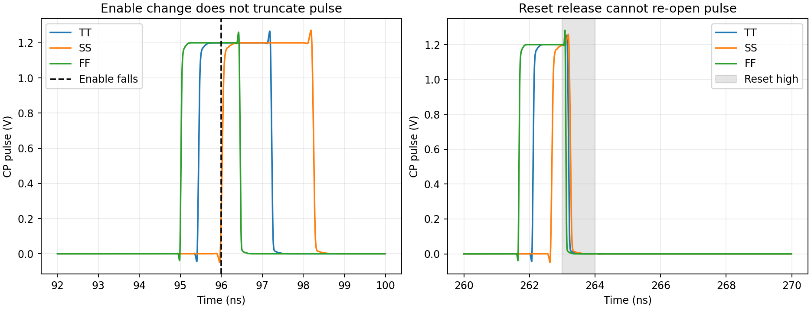
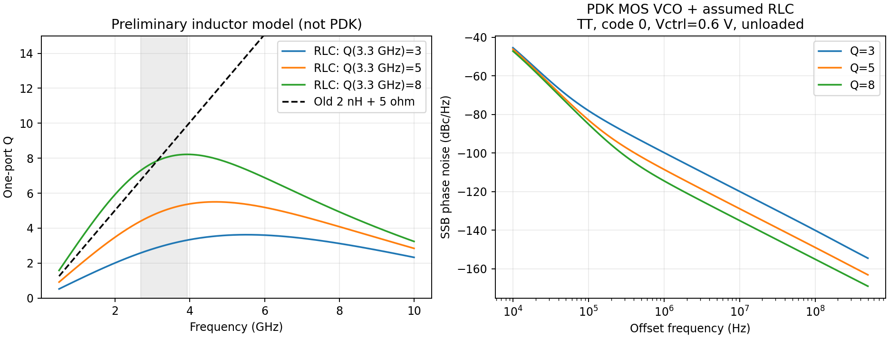
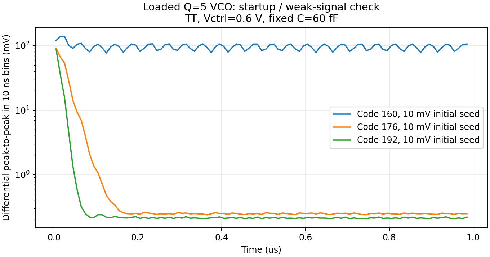

# 逻辑时序晶体管实现与电感损耗修正

本阶段补齐 CP 脉冲时序、频点配置/译码、数字资格/重启与周期测频逻辑，并完成分块和混合系统验证。**暂定 Q=5 的电感 RLC 模型暴露了旧 VCO 的低频端起振和高频覆盖问题，不能沿用此前较乐观的调谐及噪声结论。** 真实偏置/基准后置，见 [DEC-0005](../../../reports/decisions/DEC-0005.md)。

这仍不是完整全晶体管 PLL，也不是 <200 fs / ≤4 mW / <0.3 mm² 签核。`frequency_good` 已有实际计数器版本，`phase_good` 和振幅有效性检测仍未实现；GHz VCO 时钟接收/驱动仍需补齐。

## 已完成的逻辑与时序验证

- 24 级实际 MOS 延迟链与 CP 脉冲生成，去除控制路径中的 VA 定时器。低电平使能锁存避免使能变化截断既定脉冲；R2 使用带复位的锁存器，复位立即禁止输出，释放复位后先重新等待参考低电平再使能。
- 配置控制由 241 个通用门映射为 MOS。TT/27°C、SS/60°C、FF/0°C 各验证所有 64 个 K 编码和 8 次额外切换，共 216 组；仅 K=9…41 有效，选择对应 M=4/6/8/10/12/14。更新 K 期间保持分频复位，未见释放状态下的多重选通。
- 数字监督由 205 个通用门映射为 MOS。32 个连续有效参考周期取得资格；已有资格时，4 个连续无效周期请求 8 周期重启；范围错误禁止交接。三配对角与独立周期判断一致，另以更严格数值精度交叉验证。这些周期数是工作参数，不是新增验收需求。
- 配置输出代入实际六档分频，TT 下最高映射频点全部通过。电压摆幅及分频功能来自器件仿真，不是 RTL 的推算。
- 新配置/监督与实际 FLL 控制器、计数器/保持总线、DAC、预充滤波器接成控制前端。TT/SS 启动前段通过：TT 359 个边沿/计数 / SS 359 个边沿/计数。本测试止于捕获前段，未声称完成全器件完整捕获。
- 补齐 264 门周期测频监督：每 256 个参考周期测量 32 周期，关门后等待 3 周期排空进位，以 32×K±1 个计数判定。TT/SS/FF 各 11 组边界/非法码检查、TT 连续三窗好→坏→好均通过。
- 真实计数器/保持链在 TT 的 984 MHz 完整窗读到 1312 个边沿；216 MHz 及对应 M=14 的 VCO 相邻 ±24 MHz 谐波输入另测，见 [测频验证](results/watchdog_validation.json)。该容差是当前抗量化误差工作参数，不是新增精度验收要求。
- `pll_control_monitored.scs` 让捕获与监督共用计数器，TT 启动前段计数 359 与实际边沿一致。完整捕获后的接管、相位资格和失锁重捕获仍未完成整机验证。

脉冲测量在 24 MHz、1.2 V、实际 CP 门负载下进行，正常脉冲范围如下。使能在脉冲中改变、复位在脉冲中断言并在原脉冲窗口内释放均有覆盖。

| 配对角 | 相对参考延迟 ns | 脉宽 ns | 边界检查 |
|---|---:|---:|---|
| TT | 2.091 | 1.782 | 通过 |
| SS | 2.666 | 2.228 | 通过 |
| FF | 1.660 | 1.441 | 通过 |



独立 TT 配置/监督在所测活动序列中的功耗约 6.34/5.12 µW，不含其下游分频、FLL 或 GHz 时钟链。此处是单块条件，不能与不同 TB 的数字直接相加作为总功耗。

## 性能影响：重新匹配采样/CP 工作点

脉冲变窄后，TT 的实际 Kpd=0.245074 µA/rad，是旧理想约 2.083 ns 脉冲的 0.8168 倍。因此不能假定逻辑替换不改变环路增益。

采用 MOS 脉冲 R2，重新插值得到近零平均电流工作点：1.2 V、3.936 GHz 差分峰值 0.4 V、输入和 CP 输出共模 0.6 V、24 MHz 理想参考（10 ps 边沿）、TT/27°C。中心平均电流 -0.0440 pA；Kpd 由相差 0.04° 的两次实际 PSS 平均电流差得到，中心点随后插值并重新仿真。

- 1 MHz 输出电流 ASD：0.5906 pA/√Hz。
- 1 MHz 等效输入相位 ASD：2.41e-06 rad/√Hz，是旧理想脉冲匹配工作点的 1.0673 倍。
- 在本工作点，脉冲逻辑自身占 1 MHz 电流噪声功率的 0.00373%；各器件贡献求和已与总 PSD 核对。
- 电流噪声积分到 492 MHz 的值不是 PLL 输出抖动。此次没有模拟数字供电/衬底耦合、失配，新增逻辑噪声侧带设置见对应 TB；完整 PLL 仍须按 10 kHz–fout/2 验收。

## 混合闭环代回

S10 替换实际脉冲，保留真实参考缓冲、采样开关、CP、滤波器、分频和重定时输出。S11 再加入实际配置/数字监督/R2 脉冲。两类均保留 VA VCO、理想 VCO 派生 CMOS 时钟、固定粗调码及受控交接；S11 的物理相位检测接口保持为 0，`qualified` 不作为锁定证据。

这些混合 TB 沿用 v1 `cells.scs` 中的 `tx_reference_buffer`。v2 改进参考缓冲的独立噪声结果不能直接算作本顶层性能。

6 µs 仿真中，末端 4–6 µs 输出边沿测量，以及最后 0.5 µs 同一参考相位下的控制电压峰峰值如下。工作检查为输出均值距 984 MHz 小于 10 kHz、同相位控制变化小于 100 µV、控制电压未贴轨；这是当前实验判据，不是完整稳定性或抖动签核。

| 实验 | 输出 MHz | 同相位控制峰峰 µV | 已实现部分 mW | 占空比 |
|---|---:|---:|---:|---:|
| loop_s10_timing_tt | 984.000402 | 6.668 | 1.8884 | 54.12% |
| loop_s10_corner_ss | 983.997998 | 42.418 | 1.7420 | 55.20% |
| loop_s10_corner_ff | 983.999837 | 1.664 | 1.9385 | 52.55% |
| loop_s11_moderate_tt | 984.000932 | 32.271 | 1.9272 | 54.13% |

S10 三角原始证据采用 R1 脉冲；R2 仅修正复位恢复状态，正常脉宽在三角的变化小于 0.03 ps。R2 有三角模块复核，并在 S11 TT 做组合闭环验证。原始输入快照明确保留这一区别。

S11 采用 Spectre X AX、4 线程、reltol=10⁻³，实际日志使用 trap 积分；AX 覆盖了网表中的部分数值选项。原 APS/reltol=10⁻⁴ 运行过慢，仅保留到 0.78 µs 作精度前段对照，另保留 Gear 对照。详见 [实际求解设置对照](results/s11_solver_comparison.json)。这些前段对照不能替代完整精度收敛或抖动验证。S11 尚未接入后来新增的周期测频监督，其验证独立列于上节。

## 电感 RLC 模型及对 VCO 的影响

当前 PDK 没有电感模型，已获人类确认。采用 [电感 pi 网络及参数说明](../../blocks/transistor_v3/README.md)，文献 Q≈5 仅作参考；3.3 GHz 处的 Q=3/5/8、寄生参数及电感几何均为研究假设，见 [来源](../../sources/transistor_v3_sources.md)。没有将该模型称为 PDK 或 EM 模型。

AC 输入阻抗与独立公式的最大相对误差小于 5×10⁻⁶。Q=5 网络在 2.688/3.936 GHz 的 Q 约为 4.41/5.37，自谐振约 15.3 GHz；这些是指定 RLC 参数的计算结果，不是工艺保证。旧 2 nH + 5 Ω 支路在 3.3 GHz 为 Q≈8.3，且没有上述寄生/基底损耗。



同一实际 MOS 核心、码 0、Vctrl=0.6 V、每侧固定电容 190 fF、偏置滤波 1 MΩ/10 pF、未加采样/分频负载，PSS/Pnoise 结果：

| Q(3.3 GHz) | 振荡 GHz | 1 MHz 相噪 dBc/Hz | 差分基波峰值 V |
|---|---:|---:|---:|
| 3 | 3.6403 | -99.79 | 0.195 |
| 5 | 3.7809 | -108.52 | 0.433 |
| 8 | 3.8508 | -114.43 | 0.726 |

Q=5 将最大步长从 5 ps 收紧到 2 ps，噪声侧带从 31 增至 63 后，频率为 3.781951 GHz，相噪 -108.60 dBc/Hz；相噪变化 -0.086 dB，频率相对变化 0.027%。不同瞬态积分设置的频率有约百分之一以内偏差，调谐覆盖结论不能依靠过多有效数字。

Q=5/8 的 5 ps PSS 试验曾在未收敛的射击法迭代中出现非物理过压警告；最终周期波形恢复正常。两者均以 2 ps / 63 侧带复核，复核日志没有器件过压警告，保留原失败迭代记录。Q=8 复核相噪为 -114.43 dBc/Hz，较 5 ps 变化 0.006 dB。这不代替器件可靠性或全部内部端口电压检查。

关键负结果：

- Q=3/5 下，旧核心的码 255 未形成可用振荡。把初始差分扰动从 10 µV 增至 10 mV、改用 2 ps trap 步长，结论不变；寄生减半的 Q=5 试验也只有极小残余幅度。
- 独立小信号复核：Q=5/码 255 在约 2.523 GHz 的差分输入净电导为 +0.213 mS；Q=8 时为 −1.137 mS。正净电导与振荡衰减一致，支持负电导不足以抵消损耗的解释。
- Q=5、核心宽度由 40 µm 增到 80 µm 可恢复码 255 振荡，但频率约 2.452 GHz；参考电流由 80 µA 增到 120 µA 也可恢复，独立 VCO 功耗增至约 2.20 mW。两者仅为诊断试验，未默认为新方案。
- 接实际采样/CP/分频负载、固定电容 60 fF 后，Q=5/码 0 的控制电压 0.2–1.0 V 端点约为 3.748–3.766 GHz，尚未覆盖 3.936 GHz；码 255 只有约 0.17 mV 的残余差分信号，不能称为可用 VCO。
- 失振时分频支路仍产生约 474 MHz 边沿。这不是有效 PLL 输出，说明后续必须接入真实幅度/相位/频率有效性检测，不能仅依赖输出边沿或 FLL 完成位。

追加加载扫描在 TT、控制 0.6 V、每侧固定 60 fF、M=8 下进行。码 128 在 250–300 ns 约为 2.951 GHz、269 mV 差分峰峰，分频关系正确。码 160 的小种子试验在 300 ns 仍在增长，故对临界码采用 10 mV 初始扰动并延长到 1 µs，以最后 50 ns 重新测量：

| 电容码 | 过零频率 GHz | 差分峰峰 mV | 输出边沿频率 MHz | M=8 分频关系 |
|---|---:|---:|---:|---|
| 160 | 2.8168 | 106.006 | 465.861 | 无效 |
| 176 | — | 0.251 | 474.170 | 无效 |
| 192 | — | 0.219 | 474.174 | 无效 |



码 160 在大初始扰动下维持约 0.10 V 弱振荡，后级仍未正确分频；码 176/192 在本试验时长内没有可用振荡。输出边沿频率列保留了失效时的原始观察，不能充当有效输出。未完成全部码的起振边界扫描，也不能据此声明所需 2.688 GHz 低端已覆盖。

## 证据与复现

[功能验证](results/validation.json)、[器件噪声](results/noise_summary.json)、[起振导纳](results/startup_admittance.json)、[输入和原始证据清单](results/raw_manifest.json) 均已保存。原始 PSF、波形、日志与不可变输入快照在项目 `research/runs/spectre_transistor_v3/`，不只留在服务器。

`frontend01` 曾在异步进位仍切换时直接拟合多位计数总线，得到伪计数速率；该测量无效。`frontend02` 改为停止输入时钟、等待进位排空，再将总线结果与实际门控时钟边沿数比较。取消的严格数字初试、旧 S11 和重复角点作业保留取消原因，不算通过。Bridge 的 `convergence failure` 标签可能指初始 DC 方法的恢复尝试，最终判断须结合日志的最终错误数和实际波形检查。混合 TB 的 6 条警告为弃用环境变量和未接入电路的 target/ratio 激励节点移除；已在清单记录，未声称零警告。

运行环境是已配置的 Python/virtuoso-bridge、远端 Spectre 与工程 PDK。自有 RTL 重综合可运行 `build_control.py`；使用已有 MOS 网表无需重新综合。项目运行示例：

```text
python share/deliverables/integration/transistor_v3/run_spectre.py --run-id repeat_timing --mode aps --snapshot-run timing03 --suite timing
python share/deliverables/integration/transistor_v3/run_spectre.py --run-id repeat_config --mode aps --snapshot-run control02 --cases tb_config_tt
python share/deliverables/integration/transistor_v3/run_spectre.py --run-id repeat_q5 --mode aps --snapshot-run precision01 --cases tb_rlc_noise_q5_tight
python share/deliverables/integration/transistor_v3/run_spectre.py --run-id repeat_s11 --mode ax --threads 4 --snapshot-run system_config_ax --cases loop_s11_moderate_tt
python share/deliverables/integration/transistor_v3/run_spectre.py --run-id repeat_watchdog --mode aps --snapshot-run watchdog_harmonic --cases tb_watchdog_counter_nom tb_watchdog_counter_harm_hi tb_watchdog_counter_harm_lo
python share/deliverables/integration/transistor_v3/analyze_v3.py
python share/deliverables/integration/transistor_v3/analyze_noise_v3.py
python share/deliverables/integration/transistor_v3/analyze_watchdog.py
python share/deliverables/integration/transistor_v3/compare_s11_solvers.py
```

`--snapshot-run` 按指定运行保存的实际输入重放，避免后续编辑造成隐含版本改变。未带该参数时使用当前设计。每个 `--run-id` 必须是新名称，运行器拒绝覆盖既有证据。分析脚本按本阶段指定运行组织证据；复跑结果应明确加入比较，不能覆盖原记录。

后续优先修复 Q≈5 下的 VCO 启动/覆盖及噪声，并将已实现测频监督、相位/振幅检测和 GHz 时钟接口接入实际 PLL；偏置/基准按已确认优先级后置。全部工艺无源、供电耦合、全器件启动/重捕获、完整 PVT/Monte Carlo、布局与 PEX 仍未完成。
