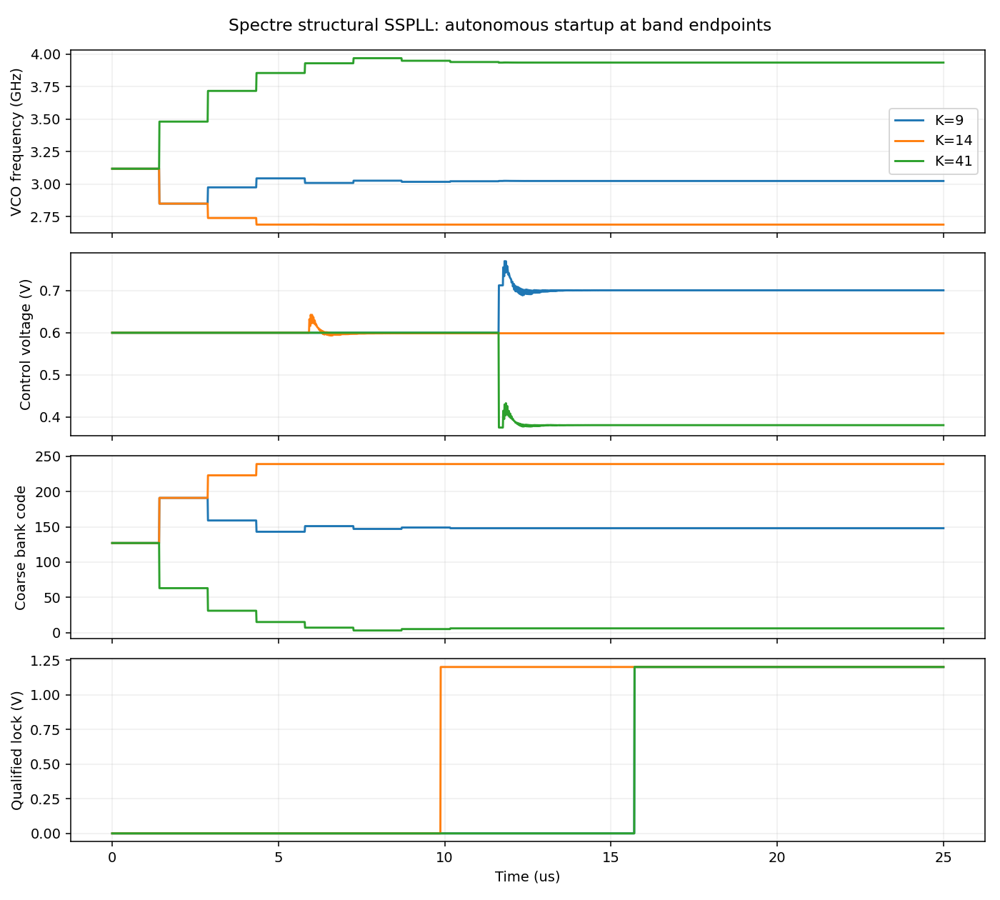
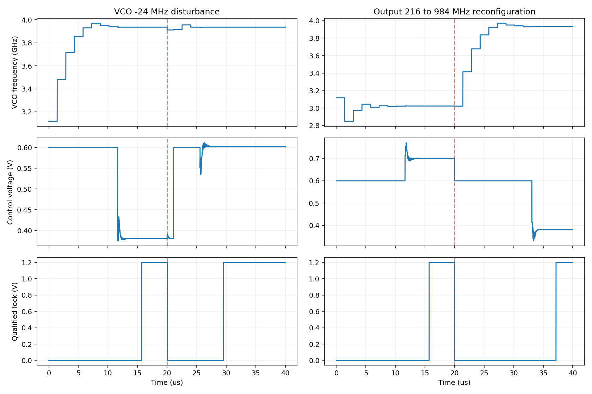

# 已接受的 Spectre 行为验证结果

26 项检查通过：16 个模块测试、1 个 Python/VA 主环逐周期对照、9 个顶层测试。证据等级为 `behavioral_sim`。

条件：1.2 V、27 °C、24 MHz 理想准方波、10 fF 临时负载。以下六个代表频点覆盖全部偶数分频比及输出/VCO 端点；不是全 33 点 Spectre 扫描。

| 输出目标 MHz | M | VCO 工作 GHz | 首次确认锁定 µs | 粗调码 | 最终 Vctrl V |
|---:|---:|---:|---:|---:|---:|
| 216 | 14 | 3.024 | 15.71 | 148 | 0.700740 |
| 240 | 12 | 2.880 | 15.71 | 183 | 0.631027 |
| 288 | 10 | 2.880 | 15.71 | 183 | 0.631027 |
| 336 | 8 | 2.688 | 9.88 | 239 | 0.598751 |
| 456 | 6 | 2.736 | 15.71 | 224 | 0.624307 |
| 984 | 4 | 3.936 | 15.71 | 6 | 0.380686 |

六个点的输出频率误差均小于 1 ppm 工作门限，占空比约 50%，重定时 setup/hold 违例为零。

在 20 µs 注入 −24 MHz VCO 扰动后，约 9.55 µs 重新确认锁定；在 20 µs 将输出从 216 MHz 切换到 984 MHz 后，约 17.17 µs 重新确认锁定。切换期间不保证输出有效或无毛刺。

独立 Python 主环模型与 Spectre 的 144 个逐周期采样点相比，最大相位差约 2.79×10⁻⁵ rad，最大控制电压差约 3.13 µV。

精度复核将 VCO 每周期最低步数 16→32，日志中的实际瞬态 reltol 10⁻⁶→2×10⁻⁸。输出频率结果变化约 1.19×10⁻⁶ ppm；这只表示确定性数值一致性，不是抖动测量。

保留负例：115 ps 分频逻辑延迟检出 99 次 setup 违例；Python 原粗调保护范围的 −1% 高端覆盖失败，以及扩展保护范围后的 +3% 低端失败。开发中的编译错误和首版精度 TB 参数未生效问题均保留日志，见 development_failures.json。

尚未验证：TSMC180 晶体管实现、随机噪声/杂散、PVT、功耗、面积和版图。FLL 周期监视占比 12.5%，必须核实其实际锁定功耗。

追溯：validation.json 为逐项数值/门限，input_manifest.json 为已验证输入 hash，raw_manifest.json 指向本项目完整原始数据及 hash，source_manifest.json 为当前可执行源文件 hash。
